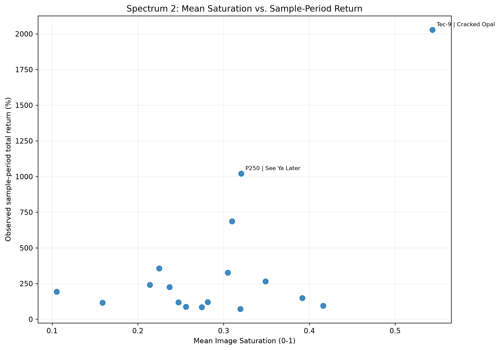
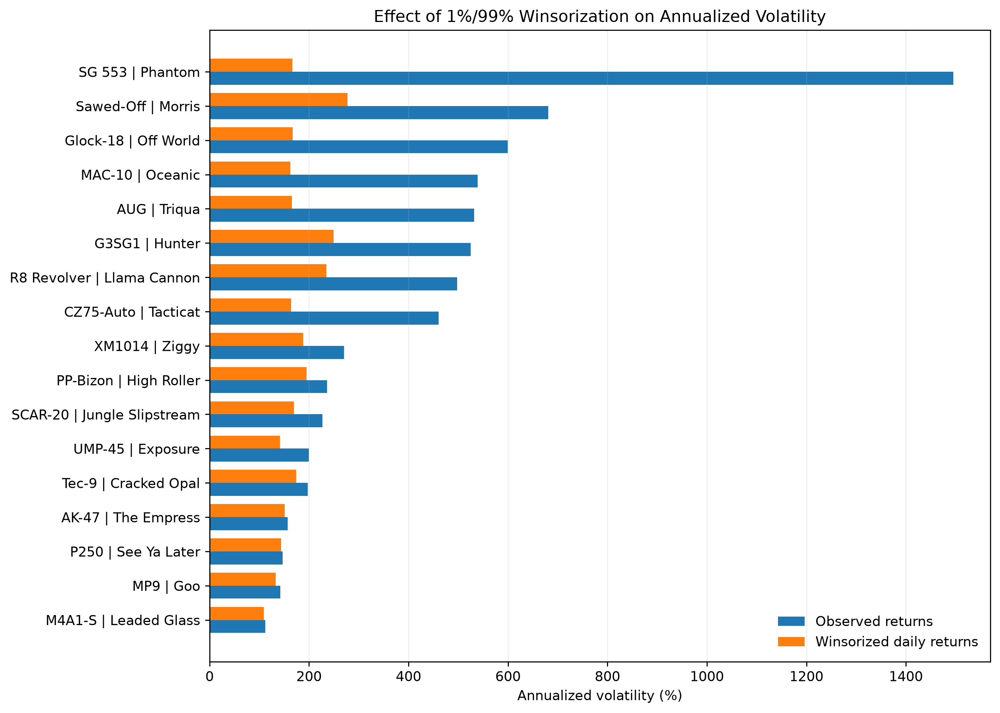

# CS2 Skins as an Alternative Asset

An independent Python research project investigating whether observable artwork characteristics are associated with historical returns and risk in the **complete 17-skin Spectrum 2 Factory New universe**. The study combines OpenSkin-reported Steam market price history, U.S. Treasury 3-month rates, and features extracted from standardized weapon images.



## Research question

Within one collection and wear condition, are skin-image characteristics associated with historical returns or risk-adjusted performance? The three pre-specified characteristics are **mean saturation, mean brightness, and palette color diversity**. This is exploratory descriptive analysis, not a causal test, a predictive trading model, or an investment recommendation.

## Research design

- **Universe:** 17 Spectrum 2 skins, Factory New, excluding StatTrak and Souvenir variants.
- **Individual-skin analysis:** September 29, 2023–September 28, 2026, using available observed skin prices. There are **18,110** skin-date price records in the frozen snapshot.
- **Portfolio comparisons:** September 29, 2023–September 15, 2026. The benchmark and all six High/Low portfolios use **identical starting and ending dates** based on the full-universe price panel. Intermediate observations can differ by portfolio because complete constituent-price availability differs; no prices are forward-filled.
- **Portfolio formation:** cross-sectional median split per characteristic; equal initial weights and fractional buy-and-hold holdings without rebalancing. High-minus-Low rows are descriptive one-day return spreads, **not** shortable investment portfolios.
- **Risk measurement:** only returns between observations exactly one calendar day apart enter daily volatility and Sharpe calculations. Treasury 3-month yields are backward-aligned and converted to daily decimal rates.
- **Robustness:** pooled 1st/99th-percentile caps on valid daily returns; the raw-price analysis is primary, while winsorized compounded returns are synthetic sensitivity measures.
- **Image features:** transparent canvas pixels are excluded from RGB/HSV, palette, and edge calculations; all visible weapon pixels are included.

## Findings from the frozen October 5 snapshot

Mean saturation has the largest **raw Pearson** correlation with sample-period total return of the three pre-specified factors (**+0.605**, Spearman **+0.179**). Under winsorized-return robustness, the corresponding correlations are **+0.437** and **+0.355**, respectively. The weaker rank association and change under winsorization caution against treating the result as a generalizable pricing effect.

Over the common portfolio period, High Saturation returned **+592.6%** versus Low Saturation **+244.0%**. Their observed-return Sharpe ratios were essentially equal (**0.988** vs. **0.990**), so the cumulative appreciation gap is **not** evidence of a risk-adjusted advantage. High Brightness returned **+601.0%**, while Low Brightness had a higher raw Sharpe (**1.285** vs. **0.928**). Color-diversity relationships are weak and mixed; Low Color Diversity returned **+464.8%** versus High Color Diversity **+396.3%**.

Outlier sensitivity is substantial: **356 of 17,707 valid daily returns (2.01%)** were capped, and several risk estimates changed materially. The starting-price diagnostic is descriptive, not a multivariate control.



## Repository layout

```text
README.md
requirements.txt
FILE_MANIFEST.txt
src/
  spectrum2_project.py
  generate_figures.py
data/
  README.md
  processed/             # Frozen CSV snapshot, including diagnostic
figures/                 # Seven publication figures
docs/
  METHODOLOGY.md
  RESULTS_AND_LIMITATIONS.md
  RESEARCH_CONTEXT.md
  VALIDATION.md
```

## Reproduce

From the repository root, install the packages in `requirements.txt` (preferably in a virtual environment):

```bash
python -m pip install -r requirements.txt
python src/spectrum2_project.py
```

The main script requests current market data, historical prices, Treasury yields, and image assets. It writes **17 analytical CSVs** to `spectrum2_output/` and downloads images to `spectrum2_images/`. It **does not** generate the publication figures. External API revisions can cause reruns to differ from the frozen snapshot. To update the committed snapshot, copy the 17 matching analytical CSVs from the *same run* into `data/processed/` before generating figures; do not mix runs.

```bash
python src/generate_figures.py
```

The figure script reads `data/processed/`, writes seven PNGs to `figures/`, and writes **one additional CSV**, `data/processed/starting_price_diagnostic.csv`. The committed figures and results correspond to the frozen October 5 data, not necessarily to a subsequent API rerun.

## Interpretation and limitations

The cross-section has only 17 assets. Rarity, starting price, liquidity, item-specific float and pattern, and changing market conditions are not fully controlled. Aggregate market history is not equivalent to executable transaction quotes. Historical returns exclude fees, spreads, slippage, market impact, and taxes; buy-and-hold positions assume fractional units and are not evidence of scalable profits. Portfolio risk statistics use unequal constituent-specific observed one-day samples, despite identical comparison endpoints. Winsorized returns are synthetic and should not be presented as realized price-path returns.

Further details: [Methodology](docs/METHODOLOGY.md) · [Results and limitations](docs/RESULTS_AND_LIMITATIONS.md) · [Research context](docs/RESEARCH_CONTEXT.md) · [Validation](docs/VALIDATION.md) · [Data guide](data/README.md).

**Tools:** Python, pandas, NumPy, requests, Pillow, ColorThief, Matplotlib.
